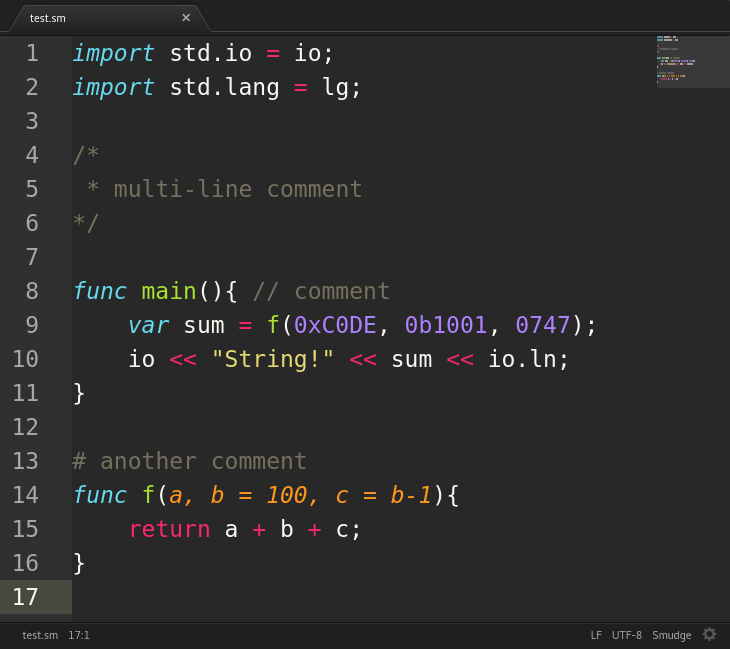

# Package `language-smudge`
**Smudge** Programming Language **highlighting syntax** support for Atom.
Here's an example:

## See Also
The main [Smudge project](https://github.com/smudgelang/smudge).

## Licensing
Like Smudge, `language-smudge` is licensed under the **Apache 2.0** license. To read the conditions take a look to the file LICENSE in the main folder.
Copyright 2017 Riccardo Musso
